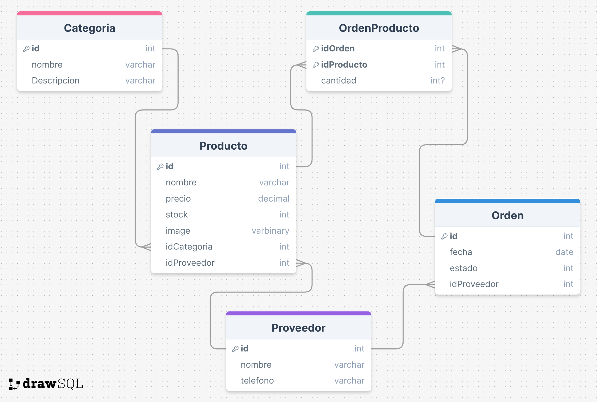
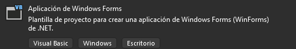
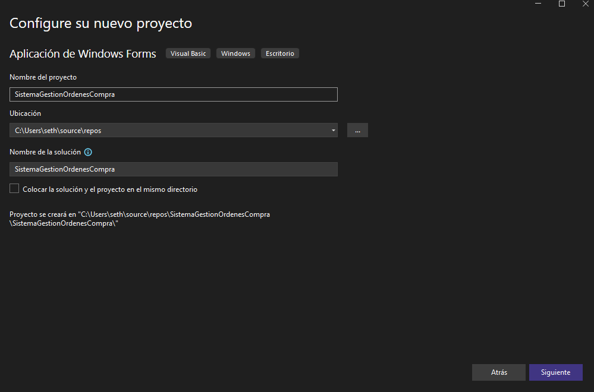
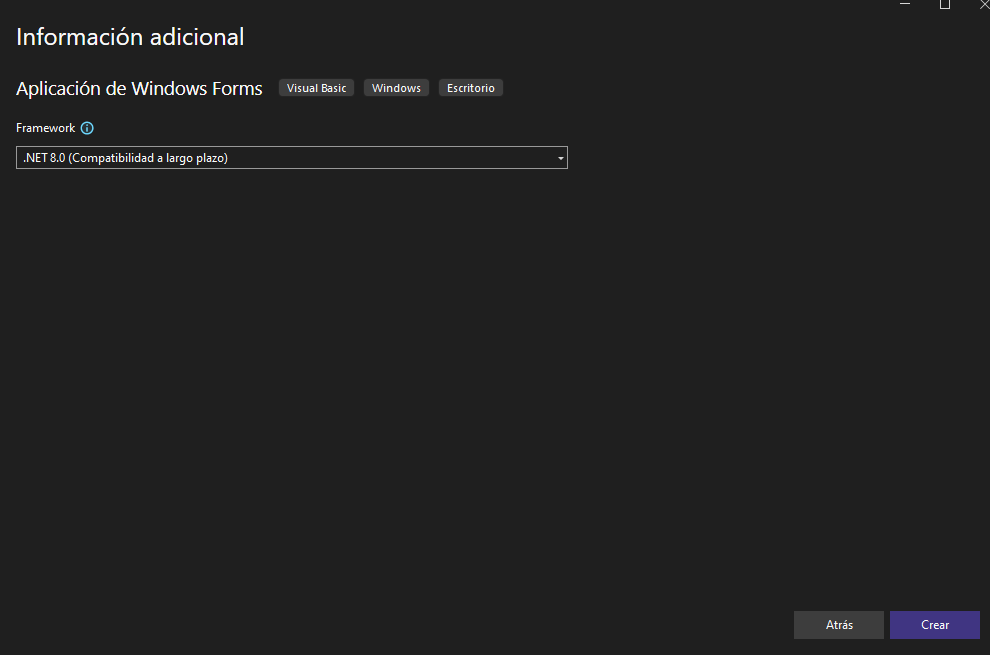

# Proyecto de Gestión de Productos en Visual Basic

## Descripción

Este repositorio contiene un proyecto de ejemplo desarrollado en Visual Basic que implementa una aplicación de gestión de productos. La aplicación permite gestionar categorías, productos, proveedores y órdenes de manera eficiente, utilizando procedimientos almacenados en SQL Server para las operaciones de la base de datos.

## Tabla de Contenidos

- [Proyecto de Gestión de Productos en Visual Basic](#proyecto-de-gestión-de-productos-en-visual-basic)
  - [Descripción](#descripción)
  - [Tabla de Contenidos](#tabla-de-contenidos)
  - [Requisitos Previos](#requisitos-previos)
  - [Configuración del Entorno](#configuración-del-entorno)
  - [Estructura de la Base de Datos](#estructura-de-la-base-de-datos)
    - [Diagrama Relacional de la Base de Datos](#diagrama-relacional-de-la-base-de-datos)
    - [Script para la Creación de Tablas](#script-para-la-creación-de-tablas)
    - [Procedimientos Almacenados \& Triggers](#procedimientos-almacenados--triggers)
      - [Procedimientos para 'Categoria'](#procedimientos-para-categoria)
      - [Procedimientos para 'Proveedor'](#procedimientos-para-proveedor)
      - [Procedimientos para 'Producto'](#procedimientos-para-producto)
      - [Procedimientos para 'Orden'](#procedimientos-para-orden)
      - [Procedimientos para 'OrdenProducto'](#procedimientos-para-ordenproducto)
      - [Procedimientos Extras](#procedimientos-extras)
    - [Triggers para Controlar el Stock del producto con base a la orden aprobada](#triggers-para-controlar-el-stock-del-producto-con-base-a-la-orden-aprobada)
  - [Desarrollo en Visual Basic](#desarrollo-en-visual-basic)
    - [Crear el proyecto de Visual Basic en Visual Studio](#crear-el-proyecto-de-visual-basic-en-visual-studio)
    - [Crear la clase](#crear-la-clase)

## Requisitos Previos

Antes de comenzar, asegúrate de tener instalados los siguientes componentes:

- Visual Studio (cualquier versión que soporte Visual Basic)
- SQL Server (cualquier versión)
- Conexión a Internet para descargar paquetes y dependencias

## Configuración del Entorno

1. **Clona este repositorio**:
    ```sh
    git clone https://github.com/seth0992/GestionOrdenesCompra-VB-SQLServer
    cd GestionOrdenesCompra-VB-SQLServer
    ```

2. **Configura la cadena de conexión**:
    Abre el archivo `App.config` y edita la cadena de conexión para apuntar a tu instancia de SQL Server.

## Estructura de la Base de Datos

La base de datos consta de las siguientes tablas:

- **Categoria**: Gestiona las categorías de los productos.
- **Proveedor**: Gestiona los proveedores.
- **Producto**: Gestiona los productos.
- **Orden**: Gestiona las órdenes.
- **OrdenProducto**: Gestiona los detalles de las órdenes.

### Diagrama Relacional de la Base de Datos



### Script para la Creación de Tablas

```sql
CREATE DATABASE gestionOrdenCompra;
GO

USE gestionOrdenCompra;
GO

CREATE TABLE Categoria (
    id INT PRIMARY KEY IDENTITY,
    nombre VARCHAR(100) NOT NULL,
    descripcion VARCHAR(255)
);
GO

CREATE TABLE Proveedor (
    id INT PRIMARY KEY IDENTITY,
    nombre VARCHAR(100) NOT NULL,
    telefono VARCHAR(20)
);
GO

CREATE TABLE Producto (
    id INT PRIMARY KEY IDENTITY,
    nombre VARCHAR(100) NOT NULL,
    precio DECIMAL(10, 2) NOT NULL,
    stock INT NOT NULL,
    image VARBINARY(MAX),
    idCategoria INT,
    idProveedor INT,
    FOREIGN KEY (idCategoria) REFERENCES Categoria(id),
    FOREIGN KEY (idProveedor) REFERENCES Proveedor(id)
);
GO

CREATE TABLE Orden (
    id INT PRIMARY KEY IDENTITY,
    fecha DATE NOT NULL,
    estado INT,
    idProveedor INT,
    FOREIGN KEY (idProveedor) REFERENCES Proveedor(id)
);
GO

CREATE TABLE OrdenProducto (
    idOrden INT,
    idProducto INT,
    cantidad INT,
    PRIMARY KEY (idOrden, idProducto),
    FOREIGN KEY (idOrden) REFERENCES Orden(id),
    FOREIGN KEY (idProducto) REFERENCES Producto(id)
);
GO

```

### Procedimientos Almacenados & Triggers

Utilizaremos procedimientos almacenados para realizar las operaciones CRUD en nuestra base de datos, adicionalmente se utilizaran algunos trigger para controlar el stock de los productos al generar una orden de compra con base al estado de la orden.

#### Procedimientos para 'Categoria'

```sql
-- Insertar Categoria
CREATE PROCEDURE InsertarCategoria
    @nombre VARCHAR(100),
    @descripcion VARCHAR(255)
AS
BEGIN
    INSERT INTO Categoria (nombre, descripcion)
    VALUES (@nombre, @descripcion);
END;
GO

-- Obtener todas las Categorias
CREATE PROCEDURE ObtenerCategorias
AS
BEGIN
    SELECT  id, nombre, descripcion FROM Categoria;
END;
GO

-- Actualizar Categoria
CREATE PROCEDURE ActualizarCategoria
    @id INT,
    @nombre VARCHAR(100),
    @descripcion VARCHAR(255)
AS
BEGIN
    UPDATE Categoria
    SET nombre = @nombre, descripcion = @descripcion
    WHERE id = @id;
END;
GO

-- Eliminar Categoria
CREATE PROCEDURE EliminarCategoria
    @id INT
AS
BEGIN
    DELETE FROM Categoria WHERE id = @id;
END;
GO

```

#### Procedimientos para 'Proveedor'

```sql

-- Insertar Proveedor
CREATE PROCEDURE InsertarProveedor
    @nombre VARCHAR(100),
    @telefono VARCHAR(20)
AS
BEGIN
    INSERT INTO Proveedor (nombre, telefono)
    VALUES (@nombre, @telefono);
END;
GO

-- Obtener todos los Proveedores
CREATE PROCEDURE ObtenerProveedores
AS
BEGIN
    SELECT  id, nombre, telefono FROM Proveedor;
END;
GO

-- Actualizar Proveedor
CREATE PROCEDURE ActualizarProveedor
    @id INT,
    @nombre VARCHAR(100),
    @telefono VARCHAR(20)
AS
BEGIN
    UPDATE Proveedor
    SET nombre = @nombre, telefono = @telefono
    WHERE id = @id;
END;
GO

-- Eliminar Proveedor
CREATE PROCEDURE EliminarProveedor
    @id INT
AS
BEGIN
    DELETE FROM Proveedor WHERE id = @id;
END;
GO

```

#### Procedimientos para 'Producto'

```sql

-- Insertar Producto
CREATE PROCEDURE InsertarProducto
    @nombre VARCHAR(100),
    @precio DECIMAL(10, 2),
    @stock INT,
    @image VARBINARY(MAX),
    @idCategoria INT,
    @idProveedor INT
AS
BEGIN
    INSERT INTO Producto (nombre, precio, stock, image, idCategoria, idProveedor)
    VALUES (@nombre, @precio, @stock, @image, @idCategoria, @idProveedor);
END;
GO

-- Obtener todos los Productos
CREATE PROCEDURE ObtenerProductos
AS
BEGIN
    SELECT  id, nombre, precio, stock, image, idCategoria, idProveedor FROM Producto;
END;
GO

-- Actualizar Producto
CREATE PROCEDURE ActualizarProducto
    @id INT,
    @nombre VARCHAR(100),
    @precio DECIMAL(10, 2),
    @stock INT,
    @image VARBINARY(MAX),
    @idCategoria INT,
    @idProveedor INT
AS
BEGIN
    UPDATE Producto
    SET nombre = @nombre, precio = @precio, stock = @stock, image = @image,
        idCategoria = @idCategoria, idProveedor = @idProveedor
    WHERE id = @id;
END;
GO

-- Eliminar Producto
CREATE PROCEDURE EliminarProducto
    @id INT
AS
BEGIN
    DELETE FROM Producto WHERE id = @id;
END;
GO


```

#### Procedimientos para 'Orden'

```sql

-- Insertar Orden
CREATE PROCEDURE InsertarOrden
    @fecha DATE,
    @estado INT,
    @idProveedor INT
AS
BEGIN
    INSERT INTO Orden (fecha, estado, idProveedor)
    VALUES (@fecha, @estado, @idProveedor);
END;
GO

-- Obtener todas las Ordenes
CREATE PROCEDURE ObtenerOrdenes
AS
BEGIN
    SELECT  id, fecha, estado, idProveedor FROM Orden;
END;
GO

-- Actualizar Orden
CREATE PROCEDURE ActualizarOrden
    @id INT,
    @fecha DATE,
    @estado INT,
    @idProveedor INT
AS
BEGIN
    UPDATE Orden
    SET fecha = @fecha, estado = @estado, idProveedor = @idProveedor
    WHERE id = @id;
END;
GO

-- Eliminar Orden
CREATE PROCEDURE EliminarOrden
    @id INT
AS
BEGIN
    DELETE FROM Orden WHERE id = @id;
END;
GO


```

#### Procedimientos para 'OrdenProducto'

```sql

-- Insertar OrdenProducto
CREATE PROCEDURE InsertarOrdenProducto
    @idOrden INT,
    @idProducto INT,
    @cantidad INT
AS
BEGIN
    INSERT INTO OrdenProducto (idOrden, idProducto, cantidad)
    VALUES (@idOrden, @idProducto, @cantidad);
END;
GO

-- Obtener todos los Productos de una Orden
CREATE PROCEDURE ObtenerProductosDeOrden
    @idOrden INT
AS
BEGIN
    SELECT idOrden, idProducto, cantidad FROM OrdenProducto WHERE idOrden = @idOrden;
END;
GO

-- Actualizar OrdenProducto
CREATE PROCEDURE ActualizarOrdenProducto
    @idOrden INT,
    @idProducto INT,
    @cantidad INT
AS
BEGIN
    UPDATE OrdenProducto
    SET cantidad = @cantidad
    WHERE idOrden = @idOrden AND idProducto = @idProducto;
END;
GO

-- Eliminar OrdenProducto
CREATE PROCEDURE EliminarOrdenProducto
    @idOrden INT,
    @idProducto INT
AS
BEGIN
    DELETE FROM OrdenProducto WHERE idOrden = @idOrden AND idProducto = @idProducto;
END;
GO


```

#### Procedimientos Extras

1. Procedimiento para insertar la orden y el detalle de la misma en una sola transacción

```sql
CREATE TYPE DetalleOrdenTipo AS TABLE
(
    idProducto INT,
    cantidad INT
);
GO

CREATE PROCEDURE InsertarOrdenConDetalle
    @fecha DATE,
    @estado INT,
    @idProveedor INT,
    @detallesOrden DetalleOrdenTipo READONLY
AS
BEGIN
    SET NOCOUNT ON;
    BEGIN TRANSACTION;

    BEGIN TRY
        DECLARE @idOrden INT;

        -- Insertar la Orden
        INSERT INTO Orden (fecha, estado, idProveedor)
        VALUES (@fecha, @estado, @idProveedor);

        SET @idOrden = SCOPE_IDENTITY();

        -- Insertar Detalles de la Orden
        INSERT INTO OrdenProducto (idOrden, idProducto, cantidad)
        SELECT @idOrden, idProducto, cantidad
        FROM @detallesOrden;

        COMMIT TRANSACTION;
    END TRY
    BEGIN CATCH
        ROLLBACK TRANSACTION;
        THROW;
    END CATCH
END;
GO

```

Nota:

- Tipo de Tabla Definido por el Usuario:
  - **DetalleOrdenTipo** es un tipo de tabla definido que contiene idProducto y cantidad.
  - **Procedimiento Almacenado**: El procedimiento almacenado InsertarOrdenConDetalle recibe la fecha, estado, idProveedor y una tabla de detalles de orden como parámetros.
  - **Transacción**: Se utiliza una transacción para asegurar que tanto la inserción de la orden como de sus detalles se realicen correctamente o se reviertan en caso de error.
  - **INSERT INTO SELECT**: Se insertan los detalles de la orden en la tabla OrdenProducto desde la variable de tabla @detallesOrden.

2. Procedimiento para consultar los datos de las producto junto a sus categoría y su proveedor.

```sql

CREATE PROCEDURE ObtenerProductosConDetalles
AS
BEGIN
    SELECT 
        p.id AS idProducto,
        p.nombre AS nombreProducto,
        p.precio,
        p.stock,
        p.image,
        c.id AS idCategoria,
        c.nombre AS nombreCategoria,
        c.descripcion AS descripcionCategoria,
        pr.id AS idProveedor,
        pr.nombre AS nombreProveedor,
        pr.telefono AS telefonoProveedor
    FROM 
        Producto p
    INNER JOIN 
        Categoria c ON p.idCategoria = c.id
    INNER JOIN 
        Proveedor pr ON p.idProveedor = pr.id;
END;
GO

```

3. Procedimiento para actualizar el estado de la orden.

```sql 
CREATE PROCEDURE ActualizarEstadoOrden
    @idOrden INT,
    @nuevoEstado INT
AS
BEGIN
    BEGIN TRY
        UPDATE Orden
        SET estado = @nuevoEstado
        WHERE id = @idOrden;

        -- Verificar si la actualización afectó alguna fila
        IF @@ROWCOUNT = 0
        BEGIN
            THROW 50001, 'No se encontró una orden con el ID proporcionado.', 1;
        END
    END TRY
    BEGIN CATCH
        -- Manejo de errores
        DECLARE @ErrorMessage NVARCHAR(4000);
        DECLARE @ErrorSeverity INT;
        DECLARE @ErrorState INT;

        SELECT 
            @ErrorMessage = ERROR_MESSAGE(),
            @ErrorSeverity = ERROR_SEVERITY(),
            @ErrorState = ERROR_STATE();

        RAISERROR (@ErrorMessage, @ErrorSeverity, @ErrorState);
    END CATCH
END;
GO


```

### Triggers para Controlar el Stock del producto con base a la orden aprobada

```sql

CREATE TRIGGER tr_AumentarStockAlAprobarOrden
ON Orden
AFTER UPDATE
AS
BEGIN
    SET NOCOUNT ON;

    -- Variable para almacenar el valor de estado "aprobada"
    DECLARE @EstadoAprobada INT = 1;

    -- Verificar si el estado se ha actualizado a "aprobada"
    IF EXISTS (
        SELECT 1 
        FROM inserted i
        JOIN deleted d ON i.id = d.id
        WHERE i.estado = @EstadoAprobada AND d.estado <> @EstadoAprobada
    )
    BEGIN
        -- Incrementar el stock de los productos correspondientes
        UPDATE p
        SET p.stock = p.stock + op.cantidad
        FROM Producto p
        INNER JOIN OrdenProducto op ON p.id = op.idProducto
        INNER JOIN inserted i ON op.idOrden = i.id
        WHERE i.estado = @EstadoAprobada;
    END
END;
GO

```

## Desarrollo en Visual Basic

### Crear el proyecto de Visual Basic en Visual Studio

1. El proyecto sera una Aplicación de Windows Forms.

   

2. Nombre del proyecto 'SistemaGestionOrdenesCompra'

   

3. Plataforma:

    

### Crear la clase