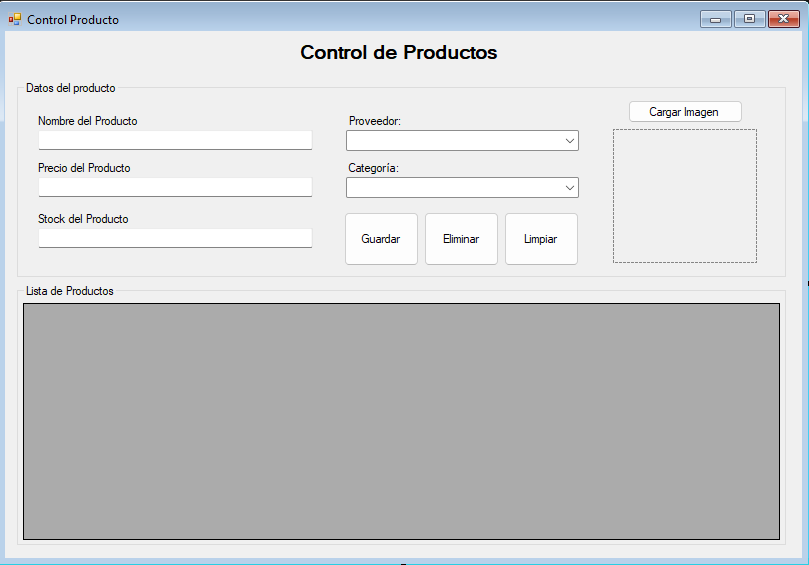
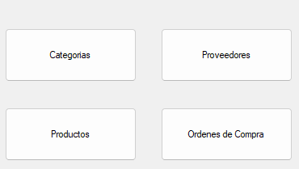

# Proyecto de Gestión de Productos en Visual Basic

## Descripción

Este repositorio contiene un proyecto de ejemplo desarrollado en Visual Basic que implementa una aplicación de gestión de productos. La aplicación permite gestionar categorías, productos, proveedores y órdenes de manera eficiente, utilizando procedimientos almacenados en SQL Server para las operaciones de la base de datos.

## Tabla de Contenidos

- [Proyecto de Gestión de Productos en Visual Basic](#proyecto-de-gestión-de-productos-en-visual-basic)
  - [Descripción](#descripción)
  - [Tabla de Contenidos](#tabla-de-contenidos)
  - [Requisitos Previos](#requisitos-previos)
  - [Configuración del Entorno](#configuración-del-entorno)
  - [Estructura de la Base de Datos](#estructura-de-la-base-de-datos)
    - [Diagrama Relacional de la Base de Datos](#diagrama-relacional-de-la-base-de-datos)
    - [Script para la Creación de Tablas](#script-para-la-creación-de-tablas)
    - [Procedimientos Almacenados \& Triggers](#procedimientos-almacenados--triggers)
      - [Procedimientos para 'Categoria'](#procedimientos-para-categoria)
      - [Procedimientos para 'Proveedor'](#procedimientos-para-proveedor)
      - [Procedimientos para 'Producto'](#procedimientos-para-producto)
      - [Procedimientos para 'Orden'](#procedimientos-para-orden)
      - [Procedimientos para 'OrdenProducto'](#procedimientos-para-ordenproducto)
      - [Procedimientos Extras](#procedimientos-extras)
    - [Triggers para Controlar el Stock del producto con base a la orden aprobada](#triggers-para-controlar-el-stock-del-producto-con-base-a-la-orden-aprobada)
  - [Desarrollo en Visual Basic](#desarrollo-en-visual-basic)
    - [Crear el proyecto de Visual Basic en Visual Studio](#crear-el-proyecto-de-visual-basic-en-visual-studio)
    - [Crear la Clase de Conexión a la Base de Datos](#crear-la-clase-de-conexión-a-la-base-de-datos)
    - [Formulario para el Control de las Categorías](#formulario-para-el-control-de-las-categorías)
      - [Eventos y Métodos para el funcionamiento del Control de Categorías](#eventos-y-métodos-para-el-funcionamiento-del-control-de-categorías)
    - [Formulario para el Control de las Proveedores](#formulario-para-el-control-de-las-proveedores)
    - [Formulario para el Control de las Productos](#formulario-para-el-control-de-las-productos)
      - [Eventos y Métodos para el funcionamiento del Control de Productos](#eventos-y-métodos-para-el-funcionamiento-del-control-de-productos)
      - [Formulario Main o Principal](#formulario-main-o-principal)
      - [Ordenes de Compra (Practica)](#ordenes-de-compra-practica)

## Requisitos Previos

Antes de comenzar, asegúrate de tener instalados los siguientes componentes:

- Visual Studio (cualquier versión que soporte Visual Basic)
- SQL Server (cualquier versión)
- Conexión a Internet para descargar paquetes y dependencias

## Configuración del Entorno

1. **Clona este repositorio**:
    ```sh
    git clone https://github.com/seth0992/GestionOrdenesCompra-VB-SQLServer
    cd GestionOrdenesCompra-VB-SQLServer
    ```

2. **Configura la cadena de conexión**:
    Abre el archivo `App.config` y edita la cadena de conexión para apuntar a tu instancia de SQL Server.

## Estructura de la Base de Datos

La base de datos consta de las siguientes tablas:

- **Categoria**: Gestiona las categorías de los productos.
- **Proveedor**: Gestiona los proveedores.
- **Producto**: Gestiona los productos.
- **Orden**: Gestiona las órdenes.
- **OrdenProducto**: Gestiona los detalles de las órdenes.

### Diagrama Relacional de la Base de Datos


### Script para la Creación de Tablas

```sql
CREATE DATABASE gestionOrdenCompra;
GO

USE gestionOrdenCompra;
GO

CREATE TABLE Categoria (
    id INT PRIMARY KEY IDENTITY,
    nombre VARCHAR(100) NOT NULL,
    descripcion VARCHAR(255)
);
GO

CREATE TABLE Proveedor (
    id INT PRIMARY KEY IDENTITY,
    nombre VARCHAR(100) NOT NULL,
    telefono VARCHAR(20)
);
GO

CREATE TABLE Producto (
    id INT PRIMARY KEY IDENTITY,
    nombre VARCHAR(100) NOT NULL,
    precio DECIMAL(10, 2) NOT NULL,
    stock INT NOT NULL,
    image VARBINARY(MAX),
    idCategoria INT,
    idProveedor INT,
    FOREIGN KEY (idCategoria) REFERENCES Categoria(id),
    FOREIGN KEY (idProveedor) REFERENCES Proveedor(id)
);
GO

CREATE TABLE Orden (
    id INT PRIMARY KEY IDENTITY,
    fecha DATE NOT NULL,
    estado INT,
    idProveedor INT,
    FOREIGN KEY (idProveedor) REFERENCES Proveedor(id)
);
GO

CREATE TABLE OrdenProducto (
    idOrden INT,
    idProducto INT,
    cantidad INT,
    PRIMARY KEY (idOrden, idProducto),
    FOREIGN KEY (idOrden) REFERENCES Orden(id),
    FOREIGN KEY (idProducto) REFERENCES Producto(id)
);
GO

```

### Procedimientos Almacenados & Triggers

Utilizaremos procedimientos almacenados para realizar las operaciones CRUD en nuestra base de datos, adicionalmente se utilizaran algunos trigger para controlar el stock de los productos al generar una orden de compra con base al estado de la orden.

#### Procedimientos para 'Categoria'

```sql
-- Insertar Categoria
CREATE PROCEDURE InsertarCategoria
    @nombre VARCHAR(100),
    @descripcion VARCHAR(255)
AS
BEGIN
    INSERT INTO Categoria (nombre, descripcion)
    VALUES (@nombre, @descripcion);
END;
GO

-- Obtener todas las Categorias
CREATE PROCEDURE ObtenerCategorias
AS
BEGIN
    SELECT  id, nombre, descripcion FROM Categoria;
END;
GO

-- Actualizar Categoria
CREATE PROCEDURE ActualizarCategoria
    @id INT,
    @nombre VARCHAR(100),
    @descripcion VARCHAR(255)
AS
BEGIN
    UPDATE Categoria
    SET nombre = @nombre, descripcion = @descripcion
    WHERE id = @id;
END;
GO

-- Eliminar Categoria
CREATE PROCEDURE EliminarCategoria
    @id INT
AS
BEGIN
    DELETE FROM Categoria WHERE id = @id;
END;
GO

```

#### Procedimientos para 'Proveedor'

```sql

-- Insertar Proveedor
CREATE PROCEDURE InsertarProveedor
    @nombre VARCHAR(100),
    @telefono VARCHAR(20)
AS
BEGIN
    INSERT INTO Proveedor (nombre, telefono)
    VALUES (@nombre, @telefono);
END;
GO

-- Obtener todos los Proveedores
CREATE PROCEDURE ObtenerProveedores
AS
BEGIN
    SELECT  id, nombre, telefono FROM Proveedor;
END;
GO

-- Actualizar Proveedor
CREATE PROCEDURE ActualizarProveedor
    @id INT,
    @nombre VARCHAR(100),
    @telefono VARCHAR(20)
AS
BEGIN
    UPDATE Proveedor
    SET nombre = @nombre, telefono = @telefono
    WHERE id = @id;
END;
GO

-- Eliminar Proveedor
CREATE PROCEDURE EliminarProveedor
    @id INT
AS
BEGIN
    DELETE FROM Proveedor WHERE id = @id;
END;
GO

```

#### Procedimientos para 'Producto'

```sql

-- Insertar Producto
CREATE PROCEDURE InsertarProducto
    @nombre VARCHAR(100),
    @precio DECIMAL(10, 2),
    @stock INT,
    @image VARBINARY(MAX),
    @idCategoria INT,
    @idProveedor INT
AS
BEGIN
    INSERT INTO Producto (nombre, precio, stock, image, idCategoria, idProveedor)
    VALUES (@nombre, @precio, @stock, @image, @idCategoria, @idProveedor);
END;
GO

-- Obtener todos los Productos
CREATE PROCEDURE ObtenerProductos
AS
BEGIN
    SELECT  id, nombre, precio, stock, image, idCategoria, idProveedor FROM Producto;
END;
GO

-- Actualizar Producto
CREATE PROCEDURE ActualizarProducto
    @id INT,
    @nombre VARCHAR(100),
    @precio DECIMAL(10, 2),
    @stock INT,
    @image VARBINARY(MAX),
    @idCategoria INT,
    @idProveedor INT
AS
BEGIN
    UPDATE Producto
    SET nombre = @nombre, precio = @precio, stock = @stock, image = @image,
        idCategoria = @idCategoria, idProveedor = @idProveedor
    WHERE id = @id;
END;
GO

-- Eliminar Producto
CREATE PROCEDURE EliminarProducto
    @id INT
AS
BEGIN
    DELETE FROM Producto WHERE id = @id;
END;
GO


```

#### Procedimientos para 'Orden'

```sql

-- Insertar Orden
CREATE PROCEDURE InsertarOrden
    @fecha DATE,
    @estado INT,
    @idProveedor INT
AS
BEGIN
    INSERT INTO Orden (fecha, estado, idProveedor)
    VALUES (@fecha, @estado, @idProveedor);
END;
GO

-- Obtener todas las Ordenes
CREATE PROCEDURE ObtenerOrdenes
AS
BEGIN
    SELECT  id, fecha, estado, idProveedor FROM Orden;
END;
GO

-- Actualizar Orden
CREATE PROCEDURE ActualizarOrden
    @id INT,
    @fecha DATE,
    @estado INT,
    @idProveedor INT
AS
BEGIN
    UPDATE Orden
    SET fecha = @fecha, estado = @estado, idProveedor = @idProveedor
    WHERE id = @id;
END;
GO

-- Eliminar Orden
CREATE PROCEDURE EliminarOrden
    @id INT
AS
BEGIN
    DELETE FROM Orden WHERE id = @id;
END;
GO


```

#### Procedimientos para 'OrdenProducto'

```sql

-- Insertar OrdenProducto
CREATE PROCEDURE InsertarOrdenProducto
    @idOrden INT,
    @idProducto INT,
    @cantidad INT
AS
BEGIN
    INSERT INTO OrdenProducto (idOrden, idProducto, cantidad)
    VALUES (@idOrden, @idProducto, @cantidad);
END;
GO

-- Obtener todos los Productos de una Orden
CREATE PROCEDURE ObtenerProductosDeOrden
    @idOrden INT
AS
BEGIN
    SELECT idOrden, idProducto, cantidad FROM OrdenProducto WHERE idOrden = @idOrden;
END;
GO

-- Actualizar OrdenProducto
CREATE PROCEDURE ActualizarOrdenProducto
    @idOrden INT,
    @idProducto INT,
    @cantidad INT
AS
BEGIN
    UPDATE OrdenProducto
    SET cantidad = @cantidad
    WHERE idOrden = @idOrden AND idProducto = @idProducto;
END;
GO

-- Eliminar OrdenProducto
CREATE PROCEDURE EliminarOrdenProducto
    @idOrden INT,
    @idProducto INT
AS
BEGIN
    DELETE FROM OrdenProducto WHERE idOrden = @idOrden AND idProducto = @idProducto;
END;
GO


```

#### Procedimientos Extras

1. Procedimiento para insertar la orden y el detalle de la misma en una sola transacción

```sql
CREATE TYPE DetalleOrdenTipo AS TABLE
(
    idProducto INT,
    cantidad INT
);
GO

CREATE PROCEDURE InsertarOrdenConDetalle
    @fecha DATE,
    @estado INT,
    @idProveedor INT,
    @detallesOrden DetalleOrdenTipo READONLY
AS
BEGIN
    SET NOCOUNT ON;
    BEGIN TRANSACTION;

    BEGIN TRY
        DECLARE @idOrden INT;

        -- Insertar la Orden
        INSERT INTO Orden (fecha, estado, idProveedor)
        VALUES (@fecha, @estado, @idProveedor);

        SET @idOrden = SCOPE_IDENTITY();

        -- Insertar Detalles de la Orden
        INSERT INTO OrdenProducto (idOrden, idProducto, cantidad)
        SELECT @idOrden, idProducto, cantidad
        FROM @detallesOrden;

        COMMIT TRANSACTION;
    END TRY
    BEGIN CATCH
        ROLLBACK TRANSACTION;
        THROW;
    END CATCH
END;
GO

```

Nota:

- Tipo de Tabla Definido por el Usuario:
  - **DetalleOrdenTipo** es un tipo de tabla definido que contiene idProducto y cantidad.
  - **Procedimiento Almacenado**: El procedimiento almacenado InsertarOrdenConDetalle recibe la fecha, estado, idProveedor y una tabla de detalles de orden como parámetros.
  - **Transacción**: Se utiliza una transacción para asegurar que tanto la inserción de la orden como de sus detalles se realicen correctamente o se reviertan en caso de error.
  - **INSERT INTO SELECT**: Se insertan los detalles de la orden en la tabla OrdenProducto desde la variable de tabla @detallesOrden.

2. Procedimiento para consultar los datos de las producto junto a sus categoría y su proveedor.

```sql

CREATE PROCEDURE ObtenerProductosConDetalles
AS
BEGIN
    SELECT 
        p.id AS idProducto,
        p.nombre AS nombreProducto,
        p.precio,
        p.stock,
        p.image,
        c.id AS idCategoria,
        c.nombre AS nombreCategoria,
        c.descripcion AS descripcionCategoria,
        pr.id AS idProveedor,
        pr.nombre AS nombreProveedor,
        pr.telefono AS telefonoProveedor
    FROM 
        Producto p
    INNER JOIN 
        Categoria c ON p.idCategoria = c.id
    INNER JOIN 
        Proveedor pr ON p.idProveedor = pr.id;
END;
GO

```

3. Procedimiento para actualizar el estado de la orden.

```sql 
CREATE PROCEDURE ActualizarEstadoOrden
    @idOrden INT,
    @nuevoEstado INT
AS
BEGIN
    BEGIN TRY
        UPDATE Orden
        SET estado = @nuevoEstado
        WHERE id = @idOrden;

        -- Verificar si la actualización afectó alguna fila
        IF @@ROWCOUNT = 0
        BEGIN
            THROW 50001, 'No se encontró una orden con el ID proporcionado.', 1;
        END
    END TRY
    BEGIN CATCH
        -- Manejo de errores
        DECLARE @ErrorMessage NVARCHAR(4000);
        DECLARE @ErrorSeverity INT;
        DECLARE @ErrorState INT;

        SELECT 
            @ErrorMessage = ERROR_MESSAGE(),
            @ErrorSeverity = ERROR_SEVERITY(),
            @ErrorState = ERROR_STATE();

        RAISERROR (@ErrorMessage, @ErrorSeverity, @ErrorState);
    END CATCH
END;
GO


```

### Triggers para Controlar el Stock del producto con base a la orden aprobada

```sql

CREATE TRIGGER tr_AumentarStockAlAprobarOrden
ON Orden
AFTER UPDATE
AS
BEGIN
    SET NOCOUNT ON;

    -- Variable para almacenar el valor de estado "aprobada"
    DECLARE @EstadoAprobada INT = 1;

    -- Verificar si el estado se ha actualizado a "aprobada"
    IF EXISTS (
        SELECT 1 
        FROM inserted i
        JOIN deleted d ON i.id = d.id
        WHERE i.estado = @EstadoAprobada AND d.estado <> @EstadoAprobada
    )
    BEGIN
        -- Incrementar el stock de los productos correspondientes
        UPDATE p
        SET p.stock = p.stock + op.cantidad
        FROM Producto p
        INNER JOIN OrdenProducto op ON p.id = op.idProducto
        INNER JOIN inserted i ON op.idOrden = i.id
        WHERE i.estado = @EstadoAprobada;
    END
END;
GO

```

## Desarrollo en Visual Basic

### Crear el proyecto de Visual Basic en Visual Studio

1. El proyecto sera una Aplicación de Windows Forms.

   

2. Nombre del proyecto 'SistemaGestionOrdenesCompra'

   

3. Plataforma:

    

### Crear la Clase de Conexión a la Base de Datos

Para crear la clase de conexión se deberá dar clic derecho sobre el proyecto y en la opción de *Agregar*, seleccionan *Clase*, a como se muestra en la siguiente imagen:


Como nombre para la clase le colocaremos: *ConexionBD* y a continuación deberemos digitar el siguiente código:

```vb
Imports System.Data.SqlClient

' Clase para manejar la conexión a la base de datos
Public Class ConexionBD

    ' Atributos de la clase ConexionBD
    ' NOTA: Los valores de estos atributos deben ajustarse según las necesidades específicas de la conexión a la base de datos.
    Private server As String = "" ' Nombre del servidor SQL Server
    Private baseDatos As String = "gestionOrdenCompra" ' Nombre de la base de datos
    Private idUsuario As String = "" ' ID de usuario para la autenticación SQL Server
    Private password As String = "" ' Contraseña para la autenticación SQL Server
    Private conexion As SqlConnection ' Objeto de conexión SQL

    ' Método para construir la cadena de conexión
    ' @param tipoAutenticacion: Indica si se utiliza autenticación SQL Server (True) o autenticación integrada (False)
    ' @return: Cadena de conexión
    Private Function obtenerStringConexion(Optional ByVal tipoAutenticacion As Boolean = False) As String
        ' Si tipoAutenticacion es verdadero, se usa autenticación de SQL Server
        If (tipoAutenticacion) Then
            Return $"Server={server}; Database={baseDatos}; User Id={idUsuario}; password={password}"
        Else
            ' Si tipoAutenticacion es falso, se usa autenticación integrada de Windows
            Return $"Server={server}; Database={baseDatos}; Integrated Security=True;"
        End If
    End Function

    ' Método para obtener una conexión abierta a la base de datos
    ' @return: Objeto SqlConnection abierto
    Public Function GetOpenConnection() As SqlConnection
        ' Crear una nueva conexión usando autenticación integrada
        conexion = New SqlConnection(obtenerStringConexion(False))

        Try
            ' Intentar abrir la conexión
            conexion.Open()
        Catch ex As Exception
            ' En caso de error, lanzar una nueva excepción con el mensaje de error
            Throw New Exception($"Error al abrir la conexión: {ex.Message}")
        End Try

        ' Devolver la conexión abierta
        Return conexion
    End Function

    ' Método para cerrar la conexión a la base de datos
    Public Sub CloseConnection()
        Try
            ' Verificar si la conexión está abierta antes de cerrarla
            If conexion IsNot Nothing AndAlso conexion.State = ConnectionState.Open Then
                conexion.Close()
            End If
        Catch ex As Exception
            ' En caso de error al cerrar la conexión, lanzar una nueva excepción con el mensaje de error
            Throw New Exception("Error al cerrar la conexión " & ex.Message)
        End Try
    End Sub

End Class

```

### Formulario para el Control de las Categorías

En este punto se deberá crear un nuevo Formulario, para ello se deberá dar clic derecho sobre el proyecto y en la opción de *Agregar*, seleccionan *Formulario*, a como se muestra en la siguiente imagen:


Como nombre para el formulario utilizaremos **frmControlCategoria** a como se muestra en la siguiente imagen:


Ahora se deberá de agregar los controles necesario al formulario, los cuales se detallan a continuación:

<table>
<thead>
  <tr>
    <th>Componente</th>
    <th>Propiedad</th>
    <th>Valor de la propiedad</th>
  </tr></thead>
<tbody>
  <tr>
    <td>Label</td>
    <td>Text</td>
    <td>Control de Categorías</td>
  </tr>
  <tr>
    <td>GroupBox</td>
    <td>Text</td>
    <td>Datos de la Categoría</td>
  </tr>
  <tr>
    <td>Label</td>
    <td>Text</td>
    <td>Nombre de la Categoría:</td>
  </tr>
  <tr>
    <td>Label</td>
    <td>Text</td>
    <td>Descripción de la Categoría:</td>
  </tr>
  <tr>
    <td rowspan="2">TextBox</td>
    <td>Text</td>
    <td>En blanco</td>
  </tr>
  <tr>
    <td>Name</td>
    <td>txtNombre</td>
  </tr>
  <tr>
    <td rowspan="2">TextBox</td>
    <td>Text</td>
    <td>En blanco</td>
  </tr>
  <tr>
    <td>Name</td>
    <td>txtDescripcion</td>
  </tr>
  <tr>
    <td rowspan="2">Button</td>
    <td>Text</td>
    <td>Guardar</td>
  </tr>
  <tr>
    <td>Name</td>
    <td>btnGuardar</td>
  </tr>
  <tr>
    <td rowspan="2">Button</td>
    <td>Text</td>
    <td>Eliminar</td>
  </tr>
  <tr>
    <td>Name</td>
    <td>btnEliminar</td>
  </tr>
  <tr>
    <td rowspan="2">Button</td>
    <td>Text</td>
    <td>Limpiar</td>
  </tr>
  <tr>
    <td>Name</td>
    <td>btnLimpiar</td>
  </tr>
  <tr>
    <td>GroupBox</td>
    <td>Text</td>
    <td>Listado de Categorías</td>
  </tr>
  <tr>
    <td rowspan="3">DataGridView</td>
    <td>Name</td>
    <td>dgvListaDatos</td>
  </tr>
  <tr>
    <td>AutoSizeRowsMode</td>
    <td>AllCells</td>
  </tr>
  <tr>
    <td>AutoSizeColumnsMode</td>
    <td>Fill</td>
  </tr>
</tbody>
</table>

El formulario deberá quedar de una forma similar a la siguiente:


#### Eventos y Métodos para el funcionamiento del Control de Categorías

1. Crear a nivel de clase dos variables:

    ```vb
    Dim conexion As New ConexionBD()
    Dim idCategoriaSeleccionada As Integer = -1
    ```

2. Crear los métodos para consultar, eliminar, modificar y registrar nuevas categorías
   
   ```vb
    ' Método para registrar una nueva categoría usando un procedimiento almacenado
    ' @param nombreC: Nombre de la categoría
    ' @param desc: Descripción de la categoría
    Private Sub RegistrarCategoriaSP(ByVal nombreC As String, ByVal desc As String)
        ' Obtener una conexión abierta
        Dim connection As SqlConnection = conexion.GetOpenConnection()

        Try
            ' Usar un comando SQL para llamar al procedimiento almacenado "InsertarCategoria"
            Using command As New SqlCommand("InsertarCategoria", connection)
                command.CommandType = CommandType.StoredProcedure
                command.Parameters.AddWithValue("@nombre", nombreC)
                command.Parameters.AddWithValue("@descripcion", desc)
                command.ExecuteNonQuery()
            End Using

            ' Mostrar un mensaje de éxito
            MsgBox("Categoría agregada con éxito!", MsgBoxStyle.Information, "Registro Categorías")
        Catch ex As Exception
            ' Manejar cualquier error que ocurra
            MsgBox($"Error: {ex.Message}")
        Finally
            ' Cerrar la conexión
            conexion.CloseConnection()
        End Try

        ' Actualizar la lista de categorías y limpiar los datos del formulario
        ConsultarCategoria()
        limpiarDatos()
    End Sub

    ' Método para consultar todas las categorías usando un procedimiento almacenado
    Private Sub ConsultarCategoria()
        ' Obtener una conexión abierta
        Dim connection As SqlConnection = conexion.GetOpenConnection()

        Try
            ' Usar un comando SQL para llamar al procedimiento almacenado "ObtenerCategorias"
            Using command As New SqlCommand("ObtenerCategorias", connection)
                command.CommandType = CommandType.StoredProcedure

                ' Ejecutar el comando y llenar un DataTable con los resultados
                Dim adapter As New SqlDataAdapter(command)
                Dim dataTable As New DataTable()
                adapter.Fill(dataTable)

                ' Asignar el DataTable como fuente de datos para el DataGridView
                dgvListaDatos.DataSource = dataTable
            End Using
        Catch ex As Exception
            ' Manejar cualquier error que ocurra
            MsgBox($"Error: {ex.Message}")
        Finally
            ' Cerrar la conexión
            conexion.CloseConnection()
        End Try
    End Sub

    ' Método para modificar una categoría existente usando un procedimiento almacenado
    ' @param nombreC: Nombre de la categoría
    ' @param desc: Descripción de la categoría
    ' @param id: ID de la categoría a modificar
    Private Sub ModificarCategoriaSP(ByVal nombreC As String, ByVal desc As String, ByVal id As Integer)
        ' Obtener una conexión abierta
        Dim connection As SqlConnection = conexion.GetOpenConnection()

        Try
            ' Usar un comando SQL para llamar al procedimiento almacenado "ActualizarCategoria"
            Using command As New SqlCommand("ActualizarCategoria", connection)
                command.CommandType = CommandType.StoredProcedure
                command.Parameters.AddWithValue("@id", id)
                command.Parameters.AddWithValue("@nombre", nombreC)
                command.Parameters.AddWithValue("@descripcion", desc)
                command.ExecuteNonQuery()
            End Using

            ' Mostrar un mensaje de éxito
            MsgBox("Categoría modificada con éxito!", MsgBoxStyle.Information, "Modificación Categorías")
        Catch ex As Exception
            ' Manejar cualquier error que ocurra
            MsgBox($"Error: {ex.Message}")
        Finally
            ' Cerrar la conexión
            conexion.CloseConnection()
        End Try

        ' Actualizar la lista de categorías y limpiar los datos del formulario
        ConsultarCategoria()
        limpiarDatos()
    End Sub

    ' Método para eliminar una categoría usando un procedimiento almacenado
    ' @param id: ID de la categoría a eliminar
    Private Sub EliminarCategoriaSP(ByVal id As Integer)
        ' Obtener una conexión abierta
        Dim connection As SqlConnection = conexion.GetOpenConnection()

        Try
            ' Usar un comando SQL para llamar al procedimiento almacenado "EliminarCategoria"
            Using command As New SqlCommand("EliminarCategoria", connection)
                command.CommandType = CommandType.StoredProcedure
                command.Parameters.AddWithValue("@id", id)
                command.ExecuteNonQuery()
            End Using

            ' Mostrar un mensaje de éxito
            MsgBox("Categoría eliminada con éxito!", MsgBoxStyle.Information, "Eliminación Categorías")
        Catch ex As Exception
            ' Manejar cualquier error que ocurra
            MsgBox($"Error: {ex.Message}")
        Finally
            ' Cerrar la conexión
            conexion.CloseConnection()
        End Try

        ' Actualizar la lista de categorías y limpiar los datos del formulario
        ConsultarCategoria()
        limpiarDatos()
    End Sub

    ' Método para limpiar los datos del formulario
    Private Sub limpiarDatos()
        txtNombre.Text = ""
        txtDescripcion.Text = ""
        btnEliminar.Enabled = False
        idCategoriaSeleccionada = -1
    End Sub
   ```

3. Ahora se deberán crear los eventos Clic para los botones
   1. Botón Guardar

        ```vb
        ' Evento que se dispara al hacer clic en el botón "Guardar"
        Private Sub btnGuardar_Click(sender As Object, e As EventArgs) Handles btnGuardar.Click
            ' Obtener los valores de los campos de texto
            Dim nombre As String = txtNombre.Text
            Dim desc As String = txtDescripcion.Text

            ' Si hay una categoría seleccionada, modificarla; si no, registrar una nueva
            If idCategoriaSeleccionada >= 0 Then
                ModificarCategoriaSP(nombre, desc, idCategoriaSeleccionada)
            Else
                RegistrarCategoriaSP(nombre, desc)
            End If
        End Sub
        ```

   2. Botón Eliminar

        ```vb

        ' Evento que se dispara al hacer clic en el botón "Eliminar"
        Private Sub btnEliminar_Click(sender As Object, e As EventArgs) Handles btnEliminar.Click
            ' Eliminar la categoría seleccionada
            EliminarCategoriaSP(idCategoriaSeleccionada)
        End Sub

        ```

   3. botón Limpiar

        ```vb
        ' Evento que se dispara al hacer clic en el botón "Limpiar"
        Private Sub btnLimpiar_Click(sender As Object, e As EventArgs) Handles btnLimpiar.Click
            limpiarDatos()
        End Sub  

        ```

4. Ahora se creara el evento load del formulario en el cual se invocara al método para consultar las categorías y de esta manera mostrarlas

    ```vb
        ' Evento que se dispara al cargar el formulario
        Private Sub frmControlCategoria_Load(sender As Object, e As EventArgs) Handles MyBase.Load
            ' Consultar las categorías al cargar el formulario
            ConsultarCategoria()
        End Sub
    ```

5. Evento CellDoubleClick sobre el DataGridView, lo que permite que al hacer doble clic sobre un elemento se cargue la información para su modificación o eliminación:

```vb
    ' Evento que se dispara al hacer doble clic en una celda del DataGridView
    Private Sub dgvListaDatos_CellDoubleClick(sender As Object, e As DataGridViewCellEventArgs) Handles dgvListaDatos.CellDoubleClick
        ' Verificar que se haya seleccionado una fila válida
        If e.RowIndex >= 0 Then
            ' Obtener la fila seleccionada
            Dim selectedRow As DataGridViewRow = dgvListaDatos.Rows(e.RowIndex)

            ' Cargar los datos de la categoría seleccionada en los controles de entrada
            idCategoriaSeleccionada = Integer.Parse(selectedRow.Cells("id").Value.ToString())
            txtNombre.Text = selectedRow.Cells("nombre").Value.ToString()
            txtDescripcion.Text = selectedRow.Cells("descripcion").Value.ToString()

            ' Habilitar el botón "Eliminar"
            btnEliminar.Enabled = True
        End If
    End Sub
```

### Formulario para el Control de las Proveedores

**Practica:** tome como referencia la sección anterior de categorías y elabore un nuevo formulario para proveedores que tenga la funcionalidad CRUD completa, para el mismo

### Formulario para el Control de las Productos

Ahora se deberá crear un nuevo Formulario, para el control de los productos, este formulario recibirá el nombre de **frmControlProductos**, luego se deberá de agregar los controles necesario al formulario, los cuales se detallan a continuación:

<table>
    <thead>
        <tr>
            <th>Componente</th>
            <th>Propiedad</th>
            <th>Valor de la propiedad</th>
        </tr>
    </thead>
    <tbody>
        <tr>
            <td>Label</td>
            <td>Text</td>
            <td>Control de Productos</td>
        </tr>
        <tr>
            <td>GroupBox</td>
            <td>Text</td>
            <td>Datos del Producto</td>
        </tr>
        <tr>
            <td>Label</td>
            <td>Text</td>
            <td>Nombre del Producto:</td>
        </tr>
        <tr>
            <td>Label</td>
            <td>Text</td>
            <td>Precio del Producto:</td>
        </tr>
        <tr>
            <td>Label</td>
            <td>Text</td>
            <td>Stock del Producto:</td>
        </tr>
        <tr>
            <td>Label</td>
            <td>Text</td>
            <td>Proveedor del Producto:</td>
        </tr>
        <tr>
            <td>Label</td>
            <td>Text</td>
            <td>Categoria del Producto:</td>
        </tr>
        <tr>
            <td rowspan="2">TextBox</td>
            <td>Text</td>
            <td>En blanco</td>
        </tr>
        <tr>
            <td>Name</td>
            <td>txtNombre</td>
        </tr>
        <tr>
            <td rowspan="2">TextBox</td>
            <td>Text</td>
            <td>En blanco</td>
        </tr>
        <tr>
            <td>Name</td>
            <td>txtPrecio</td>
        </tr>
        <tr>
            <td rowspan="2">TextBox</td>
            <td>Text</td>
            <td>En blanco</td>
        </tr>
        <tr>
            <td>Name</td>
            <td>txtStock</td>
        </tr>
        <tr>
            <td rowspan="1">ComboBox</td>
            <td>Name</td>
            <td>cmbProveedor</td>
        </tr>
        <tr>
            <td rowspan="1">ComboBox</td>
            <td>Name</td>
            <td>cmbCategoria</td>
        </tr>
        <tr>
            <td rowspan="2">Button</td>
            <td>Text</td>
            <td>Cargar Imagen</td>
        </tr>
        <tr>
            <td>Name</td>
            <td>btnImagen</td>
        </tr>
        <tr>
            <td rowspan="1">PictureBox</td>
            <td>Name</td>
            <td>picImage</td>
        </tr>
        <tr>
            <td rowspan="2">Button</td>
            <td>Text</td>
            <td>Guardar</td>
        </tr>
        <tr>
            <td>Name</td>
            <td>btnGuardar</td>
        </tr>
        <tr>
            <td rowspan="2">Button</td>
            <td>Text</td>
            <td>Eliminar</td>
        </tr>
        <tr>
            <td>Name</td>
            <td>btnEliminar</td>
        </tr>
        <tr>
            <td rowspan="2">Button</td>
            <td>Text</td>
            <td>Limpiar</td>
        </tr>
        <tr>
            <td>Name</td>
            <td>btnLimpiar</td>
        </tr>
        <tr>
            <td>GroupBox</td>
            <td>Text</td>
            <td>Listado de Productos</td>
        </tr>
        <tr>
            <td rowspan="3">DataGridView</td>
            <td>Name</td>
            <td>dgvListaProductos</td>
        </tr>
        <tr>
            <td>AutoSizeRowsMode</td>
            <td>AllCells</td>
        </tr>
        <tr>
            <td>AutoSizeColumnsMode</td>
            <td>Fill</td>
        </tr>
    </tbody>
</table>

El formulario deberá quedar de una forma similar a la siguiente:



#### Eventos y Métodos para el funcionamiento del Control de Productos

1. Crear a nivel de clase dos variables:

    ```vb
    Dim conexion As New ConexionBD()
    Dim idProductoSeleccionado As Integer = -1
   ```

2. Evento clic para el botón "Cargar Imagen" y luego se digitada el siguiente código:

    ```vb
        Private Sub btnImagen_Click(sender As Object, e As EventArgs) Handles btnImagen.Click
            ' Crear una nueva instancia de OpenFileDialog
            Dim openFileDialog As New OpenFileDialog()

            openFileDialog.Filter = "Archivos de imagen|*.jpg;*.jpeg;*.png;*.bmp"
            openFileDialog.Title = "Seleccionar una imagen para el producto"

            ' Mostrar el openfileDialog y comprobar si el usuario selecciona un archivo
            If openFileDialog.ShowDialog() = DialogResult.OK Then
                ' Obtener la ruta del archivo seleccionado
                Dim imagePath As String = openFileDialog.FileName

                ' Cargar la imagen en el PictureBox
                picImage.Image = Image.FromFile(imagePath)

                ' Ajustar el tamaño de la imagen
                picImage.SizeMode = PictureBoxSizeMode.StretchImage
            End If
        End Sub
    ```

3. Métodos para cargar los datos de los proveedores y categorías en los combobox respectivos:

    ```vb
    Private Sub ConsultarCategoria()

        'Obtener una conexion abierta
        Dim connection As SqlConnection = conexion.GetOpenConnection()

        Try
            Using command As New SqlCommand("ObtenerCategorias", connection)
                command.CommandType = CommandType.StoredProcedure

                'Ejecutar el comando y llenar un DataTable con los resultados
                Dim adapter As New SqlDataAdapter(command)
                Dim dataTable As New DataTable()
                adapter.Fill(dataTable)


                'Cambia la fuente de datos para el combobox
                cmbCategoria.DataSource = dataTable
                cmbCategoria.DisplayMember = dataTable.Columns(1).ColumnName 'Especifica cual columna se muestra 
                cmbCategoria.ValueMember = dataTable.Columns(0).ColumnName 'Especifica cual columna se envia como valor

            End Using

        Catch ex As Exception
            MsgBox($"Error {ex.Message}")
        Finally
            conexion.CloseConnection()
        End Try
    End Sub

    Private Sub ConsultarProveedores()

        'Obtener una conexion abierta
        Dim connection As SqlConnection = conexion.GetOpenConnection()

        Try
            Using command As New SqlCommand("ObtenerProveedores", connection)
                command.CommandType = CommandType.StoredProcedure

                'Ejecutar el comando y llenar un DataTable con los resultados
                Dim adapter As New SqlDataAdapter(command)
                Dim dataTable As New DataTable()
                adapter.Fill(dataTable)


                'Cambia la fuente de datos para el combobox
                cmbProveedor.DataSource = dataTable
                cmbProveedor.DisplayMember = dataTable.Columns(1).ColumnName 'Especifica cual columna se muestra 
                cmbProveedor.ValueMember = dataTable.Columns(0).ColumnName 'Especifica cual columna se envia como valor

            End Using

        Catch ex As Exception
            MsgBox($"Error {ex.Message}")
        Finally
            conexion.CloseConnection()
        End Try
    End Sub
    ```

4. Ahora se crear el método necesario para el proceso de registro del producto:
   
   ```vb
    Private Sub RegistrarProducto(ByVal nombre As String, ByVal precio As Double, ByVal stock As Int64, ByVal idCategoria As Int16, ByVal idProveedor As Int16, ByVal image As Byte())
        ' Obtener una conexión abierta a la base de datos
        Dim connection As SqlConnection = conexion.GetOpenConnection()

        Try
            ' Crear un comando SQL para ejecutar el procedimiento almacenado "InsertarProducto"
            Using command As New SqlCommand("InsertarProducto", connection)
                ' Especificar que el comando es un procedimiento almacenado
                command.CommandType = CommandType.StoredProcedure

                ' Agregar los parámetros necesarios para el procedimiento almacenado
                command.Parameters.AddWithValue("@nombre", nombre)
                command.Parameters.AddWithValue("@precio", precio)
                command.Parameters.AddWithValue("@stock", stock)
                command.Parameters.AddWithValue("@idCategoria", idCategoria)
                command.Parameters.AddWithValue("@idProveedor", idProveedor)
                command.Parameters.Add("@image", SqlDbType.VarBinary).Value = image

                ' Ejecutar el comando para insertar el producto en la base de datos
                command.ExecuteNonQuery()
            End Using

            ' Mostrar un mensaje informando que el producto se ha agregado con éxito
            MsgBox("Producto agregado con éxito!", MsgBoxStyle.Information, "Registro Producto")
        Catch ex As Exception
            ' Mostrar un mensaje de error si ocurre una excepción
            MsgBox($"Error: {ex.Message}")
        Finally
            ' Cerrar la conexión a la base de datos
            conexion.CloseConnection()
        End Try
    End Sub
   ```

5. Método para limpiar los campos del formulario:

   ```vb
    Private Sub limpiar()
        txtNombre.Clear()
        txtPrecio.Clear()
        txtStock.Clear()
        cmbCategoria.SelectedIndex = -1
        cmbProveedor.SelectedIndex = -1
        picImage.Image = Nothing
        idProductoSeleccionado = -1
    End Sub
   ```

6. Método para modificar un  producto ingresado:

    ```vb
        Private Sub ModificarProducto(ByVal nombre As String, ByVal precio As Double, ByVal stock As Int64, ByVal idCategoria As Int16, ByVal idProveedor As Int16, ByVal image As Byte())
            ' Obtener una conexión abierta a la base de datos
            Dim connection As SqlConnection = conexion.GetOpenConnection()

            Try
                ' Crear un comando SQL para ejecutar el procedimiento almacenado "ActualizarProducto"
                Using command As New SqlCommand("ActualizarProducto", connection)
                    ' Especificar que el comando es un procedimiento almacenado
                    command.CommandType = CommandType.StoredProcedure

                    ' Agregar los parámetros necesarios para el procedimiento almacenado
                    command.Parameters.AddWithValue("@id", idProductoSeleccionado)
                    command.Parameters.AddWithValue("@nombre", nombre)
                    command.Parameters.AddWithValue("@precio", precio)
                    command.Parameters.AddWithValue("@stock", stock)
                    command.Parameters.AddWithValue("@idCategoria", idCategoria)
                    command.Parameters.AddWithValue("@idProveedor", idProveedor)
                    command.Parameters.Add("@image", SqlDbType.VarBinary).Value = image

                    ' Ejecutar el comando para insertar el producto en la base de datos
                    command.ExecuteNonQuery()
                End Using

                ' Mostrar un mensaje informando que el producto se ha agregado con éxito
                MsgBox("Producto Modificado con éxito!", MsgBoxStyle.Information, "Modificado Producto")
            Catch ex As Exception
                ' Mostrar un mensaje de error si ocurre una excepción
                MsgBox($"Error: {ex.Message}")
            Finally
                ' Cerrar la conexión a la base de datos
                conexion.CloseConnection()
            End Try
        End Sub
    ```

7. Evento clic para el botón **Guardar**, es importante recordar que este botón cumple la función de registrar y modificar, adicionalmente se agrega validaciones básicas:

   ```vb
    Private Sub btnGuardar_Click(sender As Object, e As EventArgs) Handles btnGuardar.Click
        ' Validar los campos del formulario
        If String.IsNullOrWhiteSpace(txtNombre.Text) Then
            MsgBox("Por favor, ingrese el nombre del producto.", MsgBoxStyle.Exclamation, "Validación")
            txtNombre.Focus()
            Exit Sub
        End If

        If Not Double.TryParse(txtPrecio.Text, Nothing) OrElse Convert.ToDouble(txtPrecio.Text) <= 0 Then
            MsgBox("Por favor, ingrese un precio válido para el producto.", MsgBoxStyle.Exclamation, "Validación")
            txtPrecio.Focus()
            Exit Sub
        End If

        If Not Int64.TryParse(txtStock.Text, Nothing) OrElse Convert.ToInt64(txtStock.Text) < 0 Then
            MsgBox("Por favor, ingrese una cantidad de stock válida para el producto.", MsgBoxStyle.Exclamation, "Validación")
            txtStock.Focus()
            Exit Sub
        End If

        If cmbCategoria.SelectedIndex = -1 Then
            MsgBox("Por favor, seleccione una categoría para el producto.", MsgBoxStyle.Exclamation, "Validación")
            cmbCategoria.Focus()
            Exit Sub
        End If

        If cmbProveedor.SelectedIndex = -1 Then
            MsgBox("Por favor, seleccione un proveedor para el producto.", MsgBoxStyle.Exclamation, "Validación")
            cmbProveedor.Focus()
            Exit Sub
        End If

        ' Obtener los bytes de la imagen
        Dim imageBytes As Byte() = Nothing
        If picImage.Image IsNot Nothing Then
            ' Convertir la imagen en un arreglo de bytes
            Using MS As New MemoryStream()
                picImage.Image.Save(MS, System.Drawing.Imaging.ImageFormat.Png)
                imageBytes = MS.ToArray()
            End Using
        End If


        If (idProductoSeleccionado = -1) Then
            ' Registrar el producto
            RegistrarProducto(txtNombre.Text, Convert.ToDouble(txtPrecio.Text), Convert.ToInt64(txtStock.Text), Convert.ToInt16(cmbCategoria.SelectedValue), Convert.ToInt16(cmbProveedor.SelectedValue), imageBytes)

            limpiar()
            ConsultarProductos()
        Else
            ModificarProducto(txtNombre.Text, Convert.ToDouble(txtPrecio.Text), Convert.ToInt64(txtStock.Text), Convert.ToInt16(cmbCategoria.SelectedValue), Convert.ToInt16(cmbProveedor.SelectedValue), imageBytes)

            limpiar()
            ConsultarProductos()
        End If


    End Sub
   ```

8. Método para consultar la lista de productos agregados:

   ```vb
    Private Sub ConsultarProductos()
        ' Obtener una conexión abierta
        Dim connection As SqlConnection = conexion.GetOpenConnection()

        Try
            Using command As New SqlCommand("ObtenerProductos", connection)
                command.CommandType = CommandType.StoredProcedure

                ' Ejecutar el comando y llenar un DataTable con los resultados
                Dim adapter As New SqlDataAdapter(command)
                Dim dataTable As New DataTable()
                adapter.Fill(dataTable)

                ' Crear una nueva columna para las imágenes
                dataTable.Columns.Add("ImagenProducto", GetType(Image))

                ' Rellenar la nueva columna con las imágenes convertidas
                For Each row As DataRow In dataTable.Rows
                    If Not IsDBNull(row("image")) Then
                        Dim imageBytes As Byte() = CType(row("image"), Byte())
                        Using ms As New MemoryStream(imageBytes)
                            row("ImagenProducto") = Image.FromStream(ms)
                        End Using
                    Else
                        row("ImagenProducto") = Nothing
                    End If
                Next

                ' Eliminar la columna original de bytes de imagen
                dataTable.Columns.Remove("image")

                ' Asignar el DataTable al DataGridView
                dgvListaProductos.DataSource = dataTable

                ' Verificar si la columna de imagen ya existe
                If dgvListaProductos.Columns("ImagenProducto") Is Nothing Then
                    ' Añadir una columna de imagen
                    Dim imageColumn As New DataGridViewImageColumn()
                    imageColumn.Name = "ImagenProducto"
                    imageColumn.HeaderText = "Imagen"
                    dgvListaProductos.Columns.Add(imageColumn)
                End If

            End Using
        Catch ex As Exception
            MsgBox($"Error: {ex.Message}")
        Finally
            conexion.CloseConnection()
        End Try
    End Sub
   ```

    **Nota** en este caso se debe agregar adicionalmente un evento *CellFormatting* en el DataGridView para controlar el tamaño de la imagen de la siguiente manera:

    ```vb
        Private Sub dgvListaProductos_CellFormatting(sender As Object, e As DataGridViewCellFormattingEventArgs) Handles dgvListaProductos.CellFormatting

            If dgvListaProductos.Columns("ImagenProducto") IsNot Nothing AndAlso e.ColumnIndex = dgvListaProductos.Columns("ImagenProducto").Index AndAlso e.Value IsNot Nothing Then
                Dim img As Image = CType(e.Value, Image)
                e.Value = New Bitmap(img, New Size(100, 100))
            End If

        End Sub
    ```

9. Ahora en el evento CellDoubleClick del DataGridView se deberá crear el siguiente código:

    ```vb
        Private Sub dgvListaProductos_CellDoubleClick(sender As Object, e As DataGridViewCellEventArgs) Handles dgvListaProductos.CellDoubleClick
            ' Verificar que el índice de la fila no sea -1 (cabezera del DataGridView)
            If e.RowIndex >= 0 Then
                ' Obtener la fila seleccionada
                Dim row As DataGridViewRow = dgvListaProductos.Rows(e.RowIndex)

                ' Obtener los datos de la fila y asignarlos a los controles del formulario
                txtNombre.Text = row.Cells("Nombre").Value.ToString()
                txtPrecio.Text = row.Cells("Precio").Value.ToString()
                txtStock.Text = row.Cells("Stock").Value.ToString()
                cmbCategoria.SelectedValue = row.Cells("IdCategoria").Value
                cmbProveedor.SelectedValue = row.Cells("IdProveedor").Value

                ' Cargar la imagen del producto, si existe
                If Not IsDBNull(row.Cells("ImagenProducto").Value) AndAlso row.Cells("ImagenProducto").Value IsNot Nothing Then
                    Dim img As Image = CType(row.Cells("ImagenProducto").Value, Image)
                    picImage.Image = New Bitmap(img, New Size(200, 200))
                Else
                    picImage.Image = Nothing
                End If

                ' Asignar el ID del producto seleccionado (si es necesario)
                idProductoSeleccionado = Convert.ToInt32(row.Cells("id").Value)
            End If
        End Sub
    ```

10. En el evento clic del botón Limpiar se invocara al método **limpiar()**
11. Ahora se deberá crear el método para eliminar un producto:

    ```vb
    Private Sub EliminarProducto(idProducto As Integer)
        ' Obtener una conexión abierta a la base de datos
        Dim connection As SqlConnection = conexion.GetOpenConnection()

        Try
            ' Crear un comando SQL para ejecutar el procedimiento almacenado "EliminarProducto"
            Using command As New SqlCommand("EliminarProducto", connection)
                ' Especificar que el comando es un procedimiento almacenado
                command.CommandType = CommandType.StoredProcedure

                ' Añadir el parámetro necesario para el procedimiento almacenado
                command.Parameters.AddWithValue("@idProducto", idProducto)

                ' Ejecutar el comando para eliminar el producto de la base de datos
                command.ExecuteNonQuery()
            End Using

            ' Mostrar un mensaje informando que el producto se ha eliminado con éxito
            MsgBox("Producto eliminado con éxito!", MsgBoxStyle.Information, "Eliminar Producto")

            ' Volver a cargar los productos para reflejar los cambios
            ConsultarProductos()
        Catch ex As Exception
            ' Mostrar un mensaje de error si ocurre una excepción
            MsgBox($"Error: {ex.Message}")
        Finally
            ' Cerrar la conexión a la base de datos
            conexion.CloseConnection()
        End Try
    End Sub
    ```

12. Luego en el evento clic del botón **btnEliminar** se deberá digitar el siguiente código:

    ```vb
    Private Sub btnEliminar_Click(sender As Object, e As EventArgs) Handles btnEliminar.Click
        ' Verificar que hay un producto seleccionado
        If idProductoSeleccionado <> -1 Then
            ' Confirmar la eliminación
            Dim result As DialogResult = MessageBox.Show("¿Está seguro de que desea eliminar este producto?", "Confirmar eliminación", MessageBoxButtons.YesNo, MessageBoxIcon.Question)

            If result = DialogResult.Yes Then
                ' Llamar al método EliminarProducto para eliminar el producto seleccionado
                EliminarProducto(idProductoSeleccionado)

                ' Limpiar los controles del formulario después de la eliminación
                limpiar()
                ConsultarProductos()
            End If
        Else
            MsgBox("Por favor, seleccione un producto para eliminar.", MsgBoxStyle.Exclamation, "Eliminar Producto")
        End If
    End Sub

    ```

#### Formulario Main o Principal

En el formulario principal se deberán agregar los botones de acción para mostrar cada uno de los formulario creado anteriormente:



codigo de eventos clic;

```vb
 Private Sub btnCategorias_Click(sender As Object, e As EventArgs) Handles btnCategorias.Click

     frmControlCategoria.ShowDialog()
     'frmControlCategoria.Show()

 End Sub

 Private Sub btnProducto_Click(sender As Object, e As EventArgs) Handles btnProducto.Click

     frmControlProducto.ShowDialog()

 End Sub

```

**Nota** los eventos de los botones Proveedores y Ordenes de compra se crearan según se resuelvan los componentes prácticos del laboratorio.

#### Ordenes de Compra (Practica)

Con base a lo aprendido piensa en una solución para crear las ordenes de compra y para su visualización.